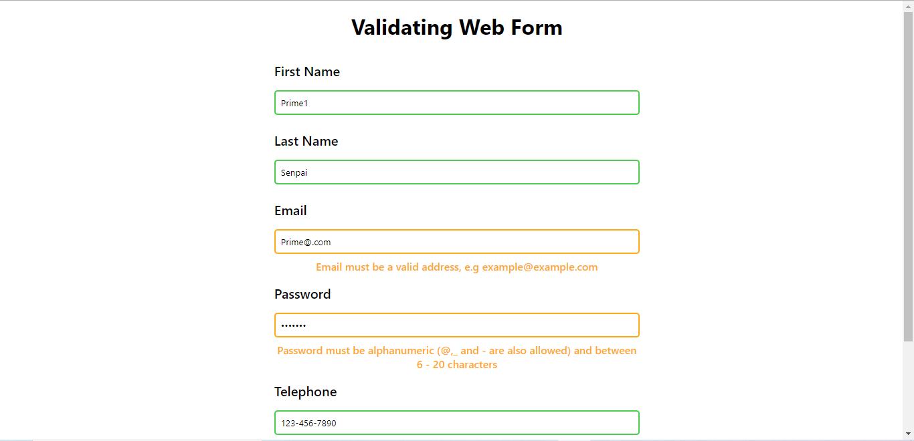

# Asabeneh-Validating_Web_Form

_An implementation of DOM Validating Web Form Project with HTML/CSS/JavaScript_

## Getting Started

Clone or download this repository and run with a local server of open `index.html` with your favorite browser

## Prequisite

- Your browser version must be recent for a better experience

## Features

- Single Page

## Tech/framework used

- HTML
- CSS
- JAVASCRIPT

## Demo

[Preview Here](https://venerable-pithivier-d2ca1c.netlify.app)

## Contact

If you want to contact me you can reach me at
-wolabash@gmail.com -https://github.com/PrimeFord

## Addtional Info

- This is one of the series of project for the @Codevillage Programming Lessons.
- This is not meant for production. It's for learning purpose only
